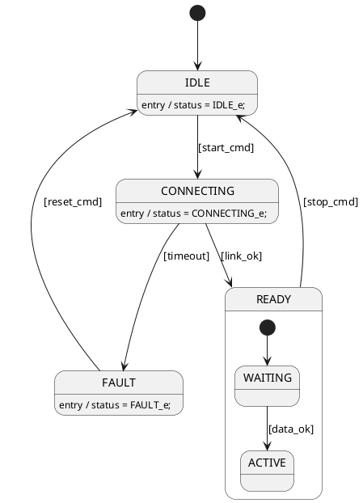

# slxgen — Authoring Workflow

**Last updated:** June 2026

---

- [slxgen — Authoring Workflow](#slxgen--authoring-workflow)
  - [1. Inputs before you start](#1-inputs-before-you-start)
    - [1.1 For human authors](#11-for-human-authors)
    - [1.2 For LLM-assisted authoring](#12-for-llm-assisted-authoring)
    - [1.3 PlantUML-first prototyping](#13-plantuml-first-prototyping)
    - [1.4 Enum type definitions](#14-enum-type-definitions)
    - [1.5 Connective junctions](#15-connective-junctions)
    - [1.6 Descriptions and requirements linking](#16-descriptions-and-requirements-linking)
    - [1.7 Parameters (calibration data)](#17-parameters-calibration-data)
  - [2. The edit-validate loop](#2-the-edit-validate-loop)
  - [3. Validation output — what each message means](#3-validation-output--what-each-message-means)
  - [4. Running the tools](#4-running-the-tools)
    - [4.1 Quick start — full pipeline in one call](#41-quick-start--full-pipeline-in-one-call)
    - [4.2 MATLAB session setup (recommended one-time step)](#42-matlab-session-setup-recommended-one-time-step)
    - [4.3 Validate + generate (explicit pipeline)](#43-validate--generate-explicit-pipeline)
    - [4.4 PlantUML visual preview](#44-plantuml-visual-preview)
    - [4.5 Inspect, compare, and extract](#45-inspect-compare-and-extract)
  - [5. Tips for LLM-assisted authoring](#5-tips-for-llm-assisted-authoring)

---

## 1. Inputs before you start

Do not open an editor until these are ready. Most rework comes from starting YAML
before the requirements are clear.

### 1.1 For human authors

| Input | What to get | Where to find it |
|-------|-------------|------------------|
| Requirements / spec | Modes, triggers, outputs per state | Your system spec document |
| Modeling level | Level 0–3 decision | `docs/stateflow_model_creation_guideline.md` §2 |
| Design rules | Naming, hierarchy, state semantics | `docs/stateflow_model_creation_guideline.md` |
| Tool orientation | Pipeline layers, what each file does | `docs/architecture.md` |
| Reference example | Working YAML with all key fields | `example/model_gen/Ex1_StMach.yaml` |
| Existing model | If reverse-engineering a legacy `.slx` | Use `slx_process()` (see §4) |

From the requirements, answer these before writing YAML:

- What are the top-level operating modes? (→ top-level states)
- Which modes are mutually exclusive? (→ OR decomposition, default)
- Which modes run in parallel? (→ AND decomposition, `type: AND`)
- What triggers each transition? (→ `condition:` field)
- What outputs does each state drive? (→ `en:` actions, output variables)
- Are any states error/fault collectors? (→ `role: sink`)
- Which groups of states belong together? (→ subchart candidates)

### 1.2 For LLM-assisted authoring

Assemble a context packet and include it in the LLM prompt before asking for YAML:

```text
Context packet (in order of importance):
  1. Requirements / spec text          ← what you want to model
  2. docs/stateflow_model_creation_guideline.md   ← design rules
  3. YAML schema summary (see below)   ← what fields are valid
  4. example/model_gen/Ex1_StMach.yaml ← concrete example
  5. Target modeling level (0–3)       ← affects allowed constructs
```

**YAML boolean trap** — PyYAML treats `ON`, `OFF`, `YES`, `NO`, `TRUE`, `FALSE`
(any capitalisation) as boolean values unless quoted. Always quote state names
and transition targets that match these words:

```yaml
# Wrong — ON and OFF silently become Python True / False
states:
  ON:
  OFF:

# Correct
states:
  'ON':
  'OFF':
transitions:
  - from: "ON"
    to:   "OFF"
```

See [ISS-008](../docs/issues.md#iss-008-yaml-boolean-synonyms-silently-corrupt-state-names-and-transition-targets) for full details.

---

**YAML schema summary** (paste this into the LLM prompt):

```yaml
name: ChartName

inputs:
  - {name: signal_in, type: boolean}
  - {name: vec_in,    type: single,         size: [3, 1]}  # 3×1 vector
  - {name: sc_in,     type: uint8,          size: [1]}     # explicit scalar
  - {name: inh_in,    type: single,         size: [-1]}    # inherited
  - {name: def_in,    type: boolean}                       # size: omitted → controlled by default_size
  - {name: mode_in,   type: "Enum: MyMode_e"}              # enumerated type

outputs:
  - {name: mode_out,  type: "Enum: MyMode_e"}              # enumerated output — Method=Enumerated
  - {name: count_out, type: uint8, initial_value: 0}

locals:
  - {name: counter,   type: uint8, initial_value: 0}

params:                         # calibration constants — Stateflow.Data with Scope='Parameter'
  - {name: DEBOUNCE_TICKS, type: uint8,  value: 10}        # inline constant value
  - {name: GAIN_VEC,       type: single, value: [1.0, 0.5], size: [2, 1]}  # vector param
  - {name: TIMEOUT_THRESH, type: uint16}                    # value omitted — set from workspace

  # size: applies equally to inputs, outputs, locals, and params.
  # size: omitted + default_size=None → no Props.Array.Size (Stateflow decides)
  # size: omitted + default_size=[1]  → Props.Array.Size = '[1]'  (explicit scalar)
  # size: omitted + default_size=[-1] → Props.Array.Size = '[-1]' (explicit inherited)

enums:                          # optional — inline enum definitions
  MyMode_e:
    storage: int8               # optional; MATLAB default is int32
    default: MODE_A             # optional; first member used if omitted
    members:
      MODE_A: 0
      MODE_B: 1
      MODE_C: 2

data_file: path/to/project_types.yaml   # optional — link a shared types YAML (relative to this file)
                                        # inline enums: override same-named types from the linked file

states:
  STATE_A:
    default: true           # initial state (one per OR parent)
    en: "output = 1;"       # entry action
    du: "counter++;"        # during action
    ex: "counter = 0;"      # exit action
    role: sink              # or: fault, error (aliases for sink)
    subchart: true          # collapsed subchart box
    type: AND               # parallel decomposition (children run simultaneously)
    history: true           # place a history junction inside this compound state
    junction: true          # connective junction — circle node, not a state box (see §1.5)
    desc: "State description text."           # freeform description (see §1.6)
    req: REQ-SYS-001                          # requirement ID, or list: [REQ-001, REQ-002]
    states:
      CHILD_STATE:
        default: true

transitions:
  - from: STATE_A
    to:   STATE_B
    order: "1"              # execution priority (lower = higher priority)
    condition: "[signal_in]"
    action: "output = 2;"   # runs before target en:
    desc: "Transition description."           # freeform description (see §1.6)
    req: REQ-SYS-002                          # requirement ID(s) — same format as states
```

### 1.3 PlantUML-first prototyping

When the FSM structure is not yet settled, start with a PlantUML sketch instead
of YAML. PlantUML renders instantly in VS Code, requires no field names or variable
types, and is easy to share with stakeholders for review. Once the topology is
stable, convert to YAML and fill in the details.

**Why this works better than going straight to YAML:**

- Topology errors (missing states, wrong hierarchy, unreachable nodes) are cheap
  to spot visually and expensive to find after YAML + MATLAB generation.
- A diagram can be reviewed by non-engineers (system architects, safety reviewers)
  who don't read YAML.
- The sketch doubles as documentation — commit the `.puml` alongside the YAML.

**The prototyping loop:**

```text
1. Sketch .puml in VS Code
        │  Alt+D to preview
        ▼
2. Does topology match the spec?
        │  NO → edit .puml, go to 1
        ▼  YES
3. Convert to YAML scaffold
        │  (manually or LLM-assisted — see below)
        │  puml_file_to_yaml() planned — see roadmap §1c
        ▼
4. Add variables: inputs / outputs / locals + types + initial_value
        ▼
5. Add actions: en: / du: / ex: per state
        ▼
6. sf_yaml_to_puml() → review updated diagram
        │  action code now visible as entry/do/exit lines
        ▼
7. run_pipeline()  →  Stateflow .slx
```

**Minimal PlantUML for state machines:**



**Key PlantUML constructs for slxgen:**

| PlantUML line | YAML equivalent |
| ------------- | --------------- |
| `[*] --> X` at root | X is the default (initial) state |
| `[*] --> X` inside `state P {}` | X is the default child of P |
| `X --> [*]` | `role: sink` on X |
| `state P { state C }` | C is a child of P in `states:` hierarchy |
| `--` inside a state block | parent has `type: AND` |
| `state J <<choice>>` | `J: {junction: true}` — connective junction (see §1.5) |
| `X : entry / code` | `en: code` on X |
| `X : do / code` | `du: code` on X |
| `X : exit / code` | `ex: code` on X |
| `A --> B : [cond]` | transition `from: A, to: B, condition: cond` |
| `A --> B : trigger [cond] / action` | transition with `trigger:`, `condition:`, `action:` |

**Converting to YAML manually (or via LLM):**

Variables (inputs/outputs/locals) have no PlantUML equivalent — add them by hand
after conversion. Everything else maps directly using the table above.

To ask an LLM to convert, provide:

```text
Convert this PlantUML state diagram to slxgen sf.yaml format.
Use the YAML schema from docs/workflow.md §1.2.
Leave inputs/outputs/locals empty — I will fill them in.
[paste .puml text]
```

**Note:** `puml_file_to_yaml()` (automatic import) is planned in roadmap §1c.
Until it is implemented, use the manual or LLM-assisted path above.

**Worked example** — `example/model_gen/` contains a complete walk-through of this
workflow using a fan mode control FSM:

| File | Role |
| ---- | ---- |
| `fan_ctrl_draft.puml` | Hand-drawn prototype — the starting specification; open in VS Code (`Alt+D`) |
| `fan_ctrl_sf.yaml` | Full specification derived from the draft: variables + `en:` actions added |
| `gen_fan_ctrl.py` | Gen script; `PUML_ONLY=True` → regenerates `fan_ctrl_gen.puml` from the YAML for comparison |
| `fan_ctrl_gen.puml` | Generated diagram (created by running the gen script) |

**Key step**: with `PUML_ONLY=True`, open `fan_ctrl_draft.puml` and `fan_ctrl_gen.puml`
side-by-side in VS Code. Check that every state, transition, and entry action from
the draft appears in the generated diagram — this confirms the YAML correctly captures
the original specification before running the full pipeline.

What was added between draft and YAML:
history junction on `MANUAL`, subchart flag, entry action code per state, and typed
variable declarations (inputs / outputs / locals).

---

### 1.4 Enum type definitions

Stateflow variables typed with user-defined enumerations use the `"Enum: TypeName"` syntax
in the `type:` field.  The enum definitions themselves live either inline in the model YAML
or in a shared file linked via `data_file:`.

**Inline enum definitions:**

```yaml
outputs:
  - {name: fan_mode, type: "Enum: FanMode_e"}
  - {name: fan_spd,  type: "Enum: FanSpd_e"}

enums:
  FanMode_e:
    storage: int8      # optional; omit for int32
    default: STANDBY   # optional; first member used if omitted
    members:
      STANDBY: 0
      BOOST:   1
      AUTO:    2
      MANUAL:  3
  FanSpd_e:
    storage: int8
    default: 'OFF'     # quote OFF/ON/YES/NO — PyYAML parses them as booleans otherwise
    members:
      'OFF': 0
      LOW:   1
      MED:   2
      HIGH:  3
```

**Shared types file** — when the same types are used by multiple models, put the definitions
in a standalone YAML and link to it via `data_file:`.  The linked file holds `enums:`
today and will accommodate `buses:` and other data types in future:

```yaml
# model YAML
data_file: ../shared/project_types.yaml   # relative to the model YAML

# ../shared/project_types.yaml
enums:
  FanMode_e:
    ...
```

Inline `enums:` entries override any same-named type from the linked file.

**Generated outputs** — `run_pipeline` produces two enum artefacts automatically:

| Option | Default | Output |
| ------ | ------- | ------ |
| `gen_enums=True` | on | One `<TypeName>.m` classdef file per type in `out_dir`; MATLAB resolves types from these files at simulation time |
| `gen_sldd=True` | off | `sldd_gen/<stem>_sldd.m` script; when `run_matlab=True` this script runs first and creates `sldd_gen/<stem>.sldd` — a Simulink Data Dictionary containing the type definitions for production use |

The classdef `.m` files and the `.sldd` must be in separate directories because `importEnumTypes`
requires the classdef files not to be on the path when importing into the dictionary.
`gen_sldd` places everything under `sldd_gen/` to keep them separate automatically.

See `example/model_gen/fan_ctrl_sf.yaml` and `example/model_gen/gen_fan_ctrl.py` for a
complete working example.

---

### 1.5 Connective junctions

A **connective junction** is a circle routing node, not a state — it has no
`en`/`du`/`ex` actions.  Transitions out of a junction carry numeric priorities
(`order:`); the last (highest-numbered) branch is the implicit else path.

In PlantUML this maps directly to the `<<choice>>` stereotype:

```plantuml
state ACTIVE {
  [*] --> j_entry
  state j_entry <<choice>>
  state NORMAL
  state BOOST
  state FAULT

  j_entry --> FAULT   : [fault_active]
  j_entry --> BOOST   : [boost_req]
  j_entry --> NORMAL
}
```

**Equivalent YAML:**

```yaml
states:
  ACTIVE:
    default: true
    states:
      j_entry:
        junction: true
        default: true      # initial routing point — default transition enters here
      NORMAL: {}
      BOOST:  {}
      FAULT:
        role: sink

transitions:
  - {from: ACTIVE.j_entry, to: ACTIVE.FAULT,  condition: fault_active, order: 1}
  - {from: ACTIVE.j_entry, to: ACTIVE.BOOST,  condition: boost_req,    order: 2}
  - {from: ACTIVE.j_entry, to: ACTIVE.NORMAL,                          order: 3}
```

**Rules:**

- `junction: true` replaces all other state fields (`en`, `du`, `ex`, `type`, `history`, `subchart`); those are silently ignored.
- A junction must have at least two outgoing transitions, each with a distinct `order:`.
- The lowest-priority (highest `order:` number) transition is the else branch — leave its `condition:` empty.
- A junction can be used as a source (`from: J`) or as a re-entry point (`to: J`) — both work.
- `sf_yaml_to_puml()` renders junctions as `<<choice>>` automatically; Stateflow renders them as small circles.

See `example/model_gen/junction_test_sf.yaml` for a complete working example.

---

### 1.6 Descriptions and requirements linking

`desc:` and `req:` fields attach human-readable context and requirement traceability
to states and transitions. Neither affects simulation — they are stored as metadata
in the generated artefacts.

**YAML syntax:**

```yaml
states:
  STANDBY:
    default: true
    desc: "Fan system idle. All outputs de-energised."
    req: REQ-FAN-001           # single ID — string or list both accepted
    en: "fan_mode=FanMode_e.STANDBY;"

  ACTIVE:
    desc: "Fan system running. Speed driven by sub-state selection."
    req: [REQ-FAN-002, REQ-FAN-003]   # multiple IDs — list form

transitions:
  - from: STANDBY
    to:   ACTIVE
    trigger: "after(debTout,tick)"
    condition: "fan_on"
    order: "1"
    req: REQ-FAN-030
    desc: "Fan activation after debounce."
```

**Generated MATLAB — state descriptions:**

When `run_pipeline` builds the `.slx`, the combined `[REQ-ID] desc text` string is
written to the state's `Description` property, visible in the Stateflow properties panel:

```matlab
s1.Description = '[REQ-FAN-001] Fan system idle. All outputs de-energised.';
s3.Description = '[REQ-FAN-002][REQ-FAN-003] Fan system running. Speed driven by sub-state selection.';
```

**Generated MATLAB — transition descriptions:**

The combined string is written to the transition's `Description` property, immediately
after the `Stateflow.Transition(...)` call:

```matlab
t3 = Stateflow.Transition(ch);
t3.Description = '[REQ-FAN-030] Fan activation after debounce.';
```

**Combined format rule** — `format_description(desc, req)` concatenates as:

```text
[REQ-ID1][REQ-ID2] description text
```

- `req:` only → `[REQ-ID]`
- `desc:` only → `description text`
- both → `[REQ-ID] description text`
- neither → nothing emitted (no `Description` assignment, no comment)

**Requirements Toolbox** — this is the *simple mode* (no Simulink Requirements Toolbox).
Requirement IDs are stored as text embedded in `Description`; they are visible in the
properties panel and searchable via `grep` on the generated `.m` script.  Full
`slreq` link objects (Priority 6d advanced) are a future roadmap item.

See `example/model_gen/fan_ctrl_sf.yaml` for a working example with `desc:` and `req:`
on all major states and the top-level transitions.

---

### 1.7 Parameters (calibration data)

A **parameter** is a `Stateflow.Data` object with `Scope = 'Parameter'` — a constant
value accessible inside the chart's action code, fixed during a simulation run but
recalibrated between runs without recompiling the model.

**When to use `params:` vs `locals:` vs `inputs:`**

| Field | MATLAB scope | Changes at runtime? | Set by |
| ----- | ------------ | ------------------- | ------ |
| `inputs:` | `Input` | Yes — every sample step | Connected Simulink signal |
| `locals:` | `Local` | Yes — chart action code writes it | Chart logic |
| `params:` | `Parameter` | No — fixed per run | Calibration / workspace |

Use `params:` for threshold values, timeout counts, lookup-table sizes, and any
constant that production calibration tools will tune between builds.

**YAML syntax:**

```yaml
params:
  - {name: DEBOUNCE_TICKS, type: uint8,  value: 10}         # inline constant
  - {name: FAULT_TIMEOUT,  type: uint16, value: 100}
  - {name: GAIN_TABLE,     type: single, size: [4, 1]}      # no value — set from workspace
```

Fields supported:

| Field | Required | Notes |
| ----- | -------- | ----- |
| `name:` | yes | referenced in action code and `after()` triggers |
| `type:` | yes | same built-in or `"Enum: X"` syntax as inputs/locals |
| `value:` | no | inline constant → `Props.InitialValue`; omit for workspace variable pattern |
| `size:` | no | same `[n, m]` / `[-1]` syntax as inputs/locals |

**Generated MATLAB — with inline value:**

```matlab
d_par1 = Stateflow.Data(ch);
d_par1.Name = 'DEBOUNCE_TICKS';
d_par1.Scope = 'Parameter';
d_par1.Props.Type.Method = 'Built-in';
d_par1.DataType = 'uint8';
d_par1.Props.InitialValue = '10';
```

**Generated MATLAB — workspace variable pattern (no `value:`):**

```matlab
d_par1 = Stateflow.Data(ch);
d_par1.Name = 'GAIN_TABLE';
d_par1.Scope = 'Parameter';
d_par1.Props.Type.Method = 'Built-in';
d_par1.DataType = 'single';
d_par1.Props.Array.Size = '[4 1]';
% Props.InitialValue left empty — value resolved from base workspace at simulation time
```

The chart references the workspace variable by matching `Name` — define
`GAIN_TABLE = Simulink.Parameter(...)` in the base workspace or SLDD before simulation.

**Using parameters in action code and triggers:**

Parameters are referenced by name exactly like locals or inputs:

```yaml
states:
  DEBOUNCE:
    en: "timer = 0;"
transitions:
  - from: DEBOUNCE
    to:   ACTIVE
    trigger: "after(DEBOUNCE_TICKS, tick)"   # parameter in after() trigger
    condition: "fan_on"
```

See `example/model_gen/fan_ctrl_sf.yaml` — `debTout` is defined as a `params:` entry
and used in all `after(debTout, tick)` triggers throughout the chart.

---

## 2. The edit-validate loop

The core workflow. Keep the loop tight — structure errors found early are cheap;
layout problems found after generation are expensive.

```text
Step 1 — Gather inputs
  requirements, guidelines, example YAML, modeling level
        │
        ▼
Step 2 — Identify structure from spec
  states, transitions, variables
  (do not write actions yet)
        │
        ▼
Step 3 — Write YAML
  Simple models: write states, transitions, and actions all at once.
  Complex models: skeleton first (states + transitions only),
                  add actions after structure is confirmed.
        │
        ▼
Step 4 — Validate + visual preview
  python example/model_gen/gen_Ex1.py   (or your own gen script)
  → ERRORs and WARNINGs printed

  Recommended: export a PlantUML diagram to verify structure and actions
  before running MATLAB:
    sf_yaml_to_puml(yaml_path, output_path='chart.puml')
  Open in VS Code (PlantUML extension, Alt+D) or paste at plantuml.com.
  Shows topology + en:/du:/ex: action code. No MATLAB required.

  Alternative (structure only, no actions):
    sf_yaml_to_mermaid(yaml_path)  →  stateDiagram-v2 string
  Paste into GitHub, VS Code, or mermaid.live.

  See §4.4 for full PlantUML workflow details.
        │
        ├── ERRORs present → fix and return to Step 4
        ├── WARNINGs present → fix or decide to suppress, return to Step 4
        ├── Visual check fails → fix structure, return to Step 4
        │
        ▼ (clean)
Step 5 — Generate
  sf_yaml_to_matlab(yaml_path, output_path)
        │
        ▼
Step 6 — Review output
  Open PNG screenshot (auto-generated, no extra step)
  Human or multimodal LLM: does the chart topology match the spec?
  Checks 8 and 9 (action semantics) will have fired in Step 4 if actions
  were written in Step 3.
        │
        ├── issues → fix YAML, return to Step 4
        │
        ▼ (approved)
Step 7 — Run in MATLAB + sfLint
  run_pipeline(..., run_matlab=True)  — builds .slx and runs sfLintChart
  sfLint result: <model>_lint.json in the output directory
  Final verification in the Stateflow editor
```

**Simple vs. complex models** — for small, straightforward state machines write
everything in one pass and go straight to Step 4. The two-pass approach (skeleton
first, actions second) pays off when the structure is uncertain: structural ERRORs
are much cheaper to fix before action logic is in place.

---

## 3. Validation output — what each message means

`sir_validate()` prefixes every message with `ERROR` or `WARNING`.
ERRORs abort generation. WARNINGs allow generation but flag design issues.

| Message pattern | Check | Meaning | Typical fix |
|-----------------|-------|---------|-------------|
| `ERROR: transition[N] source 'X' not found` | 1 | `from:` names a state that doesn't exist | Fix the state path (use dotted path for nested states, e.g. `ACTIVE.STARTUP`) |
| `ERROR: transition[N] target 'Y' not found` | 2 | `to:` names a state that doesn't exist | Same as above |
| `WARNING: transition[N] ... no 'order' field` | 3 | Transition has no `order:` — priority undefined | Add `order: "1"` (or Phase 4 normalizer will fill it in) |
| `ERROR: transitions[N] and [M] from 'X' share priority P` | 4 | Two transitions from the same state have the same `order` value | Renumber so each transition from a state has a unique `order` |
| `WARNING: 'X' has multiple default children` | 5 | More than one child has `default: true` | Remove `default: true` from all but the intended initial state |
| `WARNING: 'X' has N children but none is marked default` | 6 | An OR parent has children but no initial state | Add `default: true` to the child that should be entered first |
| `ERROR: state 'X' has both type=AND and subchart=true` | — | Stateflow forbids AND + subchart | Remove one of the two attributes |
| `WARNING: variable 'X' has no initial_value` | 7 | output or local has no default | Add `initial_value:` or suppress check via config if type is enum (defined in SLDD) |
| `WARNING: transition[N] ... action assigns 'var' which target en: also assigns` | 8 | Transition action sets a variable that the target state's `en:` will immediately overwrite | Move the assignment to `en:` only; remove it from the transition action |
| `WARNING: transition[N] ... output 'var' set here but not on path(s) from [...]` | 9 | An output is set on some entry paths to a state but not others — output value depends on how the state was entered | Move the assignment to the target state's `en:` so every entry path gets the same value |

**Suppressing warnings** — configurable via `slxgen_config.yaml` (planned):

```yaml
validator:
  initial_value_required: false      # suppress check 7 for all variables
  redundant_transition_action: off   # suppress check 8
  inconsistent_output_paths: off     # suppress check 9
```

Until the config file is implemented, add a comment in the YAML explaining the
intentional deviation.

---

## 4. Running the tools

### 4.1 Quick start — full pipeline in one call

`run_pipeline()` covers all four steps (validate → generate → MATLAB build → sfLint)
with step-by-step progress output:

```python
from slxgen import run_pipeline

run_pipeline(
    'my_chart.yaml',
    model_name='MyCtrl',
    run_matlab=True,        # False = write .m only, no MATLAB required
    session_name='slxgen',  # shared MATLAB session name
    open_desktop=False,     # True = open full MATLAB GUI when starting new engine
    lint=True,
    gen_enums=True,         # write <TypeName>.m classdef files to out_dir (default: True)
    gen_sldd=False,         # generate + run sldd_gen/<stem>_sldd.m → sldd_gen/<stem>.sldd
)
```

See `example/model_gen/quick_start.py` for a working example.

### 4.2 MATLAB session setup (recommended one-time step)

For fast iteration, keep a named MATLAB session open between runs:

```matlab
% Run once in the MATLAB Command Window:
matlab.engine.shareEngine('slxgen')
```

After this, every `run_pipeline(..., run_matlab=True)` call connects in <1 s
instead of starting a cold engine (~15–30 s). The session survives Python
restarts. Without this, `run_pipeline` starts a new engine automatically and
shares it as `'slxgen'`, but that session closes when the Python process exits.

Use `open_desktop=True` when starting a fresh engine from Python to get the full
MATLAB desktop — useful for inspecting the workspace and watching execution.

### 4.3 Validate + generate (explicit pipeline)

```python
# example/model_gen/gen_Ex1.py pattern
from slxgen.stateflow_sir import yaml_to_sir, sir_validate
import yaml, sys

chart_dict = yaml.safe_load(Path('my.yaml').read_text(encoding='utf-8'))
sir = yaml_to_sir(chart_dict)
issues = sir_validate(sir)
errors   = [m for m in issues if m.startswith('ERROR')]
warnings = [m for m in issues if m.startswith('WARNING')]
if errors:
    for msg in errors: print(msg)
    sys.exit(1)
for msg in warnings: print(msg)

from slxgen.stateflow import sf_yaml_to_matlab
sf_yaml_to_matlab('my.yaml', 'out.m')
```

**Generate only (no explicit validation step):**

```python
from slxgen.stateflow import sf_yaml_to_matlab
sf_yaml_to_matlab('my.yaml', 'out.m')
# validation still runs internally; issues printed to stderr
```

### 4.4 PlantUML visual preview

Before running MATLAB, export the YAML to a PlantUML diagram to verify the structure
and action code visually. PlantUML shows `en:`/`du:`/`ex:` actions as state description
lines, which Mermaid cannot do.

**One-liner:**

```python
from slxgen import sf_yaml_to_puml
sf_yaml_to_puml('my_chart.yaml', output_path='my_chart.puml')
```

**Via the gen script** — every `work/*/gen_*.py` script has a `PUML_ONLY` flag at the top:

```python
PUML_ONLY = True   # set to True to regenerate .puml without touching MATLAB
```

Setting it to `True` writes `generated/<chart>.puml` and exits. Set back to `False`
to run the full pipeline.

**Viewing the diagram** — any of these work without installing PlantUML locally:

| Tool | How |
| ---- | --- |
| VS Code | Install the *PlantUML* extension; open the `.puml` file and press `Alt+D` |
| GitHub | Push the `.puml` file; GitHub renders it inline if it's in a `.md` via a fenced block |
| Browser | Paste the text at [plantuml.com/plantuml](https://www.plantuml.com/plantuml) |
| LLM | Paste the text and ask "does this topology match the spec?" |

**What to check in the diagram:**

- All states present and nested correctly
- Initial states (`[*] -->`) point to the right child
- Sink/fault states have `-->  [*]`
- Entry actions (`entry /`) match the output assignments in the spec
- No obvious missing transitions

**Mermaid alternative** — `sf_yaml_to_mermaid()` produces a `stateDiagram-v2` string
that renders on GitHub and mermaid.live. It shows topology and transition labels but
**does not include `en`/`du`/`ex` actions**. Use it for quick structure-only checks
when you do not need to see action code.

---

### 4.5 Inspect, compare, and extract

#### Inspect an existing SLX model

`slx_process()` is the all-in-one inspection entry point. It parses the SLX,
enriches connections, and writes output files next to the model (or to `output_dir`):

```python
from slxgen import slx_process

slx_process('model.slx', filters={}, save=True)
# or — choose specific outputs only:
slx_process('model.slx', filters={}, save=True,
            output_dir='out/', outputs=['report.txt', 'arch.md', 'sf.yaml'])
```

**Output files** written by `slx_process()`:

| Suffix | Content | Best for |
| ------ | ------- | -------- |
| `_report.txt` | Plain-text block/connection report | LLM review — concise, no XML noise |
| `_arch.md` | Mermaid block diagram of Simulink topology | Visual topology review |
| `_slim.json` | Filtered enriched model dict | Programmatic analysis |
| `_full.json` | Raw parsed model (all XML fields) | Deep debugging |
| `_slim.min.json` | Minified slim JSON | Storage / transfer |
| `_sf.yaml` | Stateflow charts extracted as slxgen YAML | Feed to LLM for modification |
| `_sf.m` | Stateflow charts as MATLAB codegen script | Direct rebuild reference |

**For LLM review of an existing model**, use `report.txt` + `arch.md` + `sf.yaml`:

```python
from slxgen import slx_process, sf_yaml_to_puml

# Step 1 — extract
slx_process('MyCtrl.slx', filters={}, save=True, output_dir='review/',
            outputs=['report.txt', 'arch.md', 'sf.yaml'])

# Step 2 — convert extracted Stateflow YAML to PlantUML for visual review
sf_yaml_to_puml('review/MyChart_sf.yaml', output_path='review/MyChart_sf.puml')
```

Then paste `report.txt` and `MyChart_sf.puml` into the LLM conversation:

```text
"Here is the model report and Stateflow diagram.
Summarise the operating modes and identify any states with no exit transition."
```

#### Inspect in-memory (no files written)

```python
from slxgen import parse_slx, enrich_connections, model_to_text, model_to_markdown

slim = enrich_connections(parse_slx('model.slx'))
print(model_to_text(slim))          # plain-text report → paste to LLM
print(model_to_markdown(slim))      # Mermaid diagram
```

#### Compare two SLX model versions

```python
from slxgen import parse_slx, enrich_connections, compare_models

a = enrich_connections(parse_slx('model_v1.slx'))
b = enrich_connections(parse_slx('model_v2.slx'))
diff = compare_models({'v1': a, 'v2': b})
```

#### Extract SIR JSON for Stateflow chart inspection

```python
from slxgen.stateflow_sir import yaml_to_sir
import yaml, json

chart_dict = yaml.safe_load(Path('my.yaml').read_text(encoding='utf-8'))
sir = yaml_to_sir(chart_dict)
print(json.dumps([s.__dict__ for s in sir.states], indent=2))
```

---

## 5. Tips for LLM-assisted authoring

**Structure the requirements as a list, not prose.** Prose hides ambiguity; a list
forces enumeration of states and triggers.

```text
Good input for an LLM:
  Modes: IDLE, CONNECTING, READY, FAULT
  IDLE → CONNECTING when [start_cmd]
  CONNECTING → READY when [link_ok]
  CONNECTING → FAULT when [timeout]
  READY → IDLE when [stop_cmd]
  FAULT → IDLE when [reset_cmd]
  outputs: status_led (uint8, 0=off, 1=yellow, 2=green, 3=red)

Poor input:
  "The system starts idle, then connects when commanded..."
```

**Specify the modeling level** in the prompt. Without it, the LLM will default to
whatever pattern the examples show. Level 1 (industrial) is the right default for
most production models.

**Two-pass authoring works better than one-pass.** Ask for the skeleton first
(states + transitions, no actions), validate it, then ask the LLM to add actions
in a second prompt. This prevents action logic from masking structural errors.

**Use PlantUML as the fast feedback loop.** Before running MATLAB, export the YAML to
PlantUML and paste it into the LLM conversation:

```text
"Here is the PlantUML diagram of the generated state machine.
Does the topology match the requirements?
Are all states reachable? Are the entry actions correct?"
```

This loop (edit YAML → export `.puml` → review with LLM) is much faster than
running the full pipeline and catches structural issues before MATLAB is involved.

**Use the Stateflow screenshot for final review.** After running the full pipeline,
open the PNG and check the layout:

```text
"Here is the generated Stateflow chart. Does the topology match the requirements?
Are all states reachable? Does the layout look reasonable?"
```

A multimodal LLM can answer these questions from the image without running MATLAB.

**Validation errors are cheap to fix early.** If the LLM produces YAML with ERROR
messages, paste the error output back and ask for a fix before proceeding to
generation. Do not ask the LLM to "generate anyway" — ERRORs indicate structural
problems that will produce incorrect charts.
